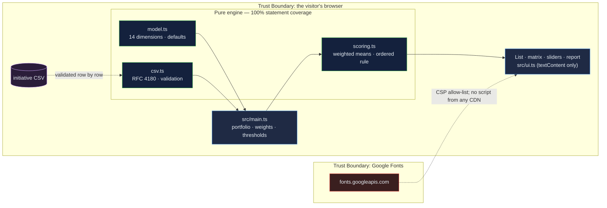

# AI Strategy Lab: build, buy, wait or review — with the rule that produced the answer

[](https://github.com/Freddricklogan/ai-strategy-lab/actions/workflows/deploy.yml)
[](#5-getting-started--verification)
[](https://github.com/Freddricklogan/ai-strategy-lab/actions/workflows/codeql.yml)
[](LICENSE)
[](https://freddricklogan.github.io/ai-strategy-lab/)

## 1. Executive Summary & Business Impact

**Problem statement.** Every institution now has a queue of AI proposals and
no shared way to rank them. The decisions get made on enthusiasm, on which
vendor visited last, or on a scoring spreadsheet whose weights nobody can see.
The proposals that carry the most risk to people — predicting who will
withdraw, who will enrol, whose essay is good enough — are also the ones
most likely to be waved through because their value is obvious.

**Solution & value delivered.** A triage console that scores each initiative
on fourteen dimensions across value, feasibility and risk, with the risk
dimensions modelled on the NIST AI Risk Management Framework's
trustworthiness characteristics, and applies an explicit, ordered rule:
risk above the ceiling goes to governance review before anything else;
value below the floor waits; feasible and differentiating builds; feasible
and commodity buys. Weights and thresholds are on the page and editable, the
rationale is printed with every recommendation, and the portfolio is one
matrix. The sample portfolio is seven initiatives typical of a university —
including the ones I would be asked to sponsor.

**[→ Read the full case study](docs/CASE_STUDY.md)**

| Outcome | How this repo delivers it |
| --- | --- |
| A decision a committee can argue with | `recommend()` is an ordered rule with four thresholds; every verdict carries a one-sentence rationale quoting the numbers |
| Risk that cannot be outvoted by value | The risk ceiling is evaluated first; a 5/5 value initiative still goes to review if its risk crosses the line |
| Weights that are yours | Every weight and threshold is editable; the default gives harm-to-people 1.5× and everything else 1× |
| A portfolio, not a list | Value × feasibility matrix with risk as size and the thresholds drawn on it; counts per recommendation |
| Your initiatives | CSV import with per-row validation and export; a print stylesheet for a PDF-ready report |

## 2. Demonstrated Competencies & Technical Skills

- **Systems Architecture & CS** — strict TypeScript; the scoring engine is
  pure (`model`, `scoring`, `csv`) and tested at every threshold boundary;
  Vite build with no inline script so a `default-src 'none'` CSP holds.
- **Data Science & AI** — the framing is AI governance rather than
  modelling: a transparent weighted-mean scorer and an explicit decision rule
  whose weights are visible, with the NIST AI RMF as the reference for the
  risk dimensions. No model is claimed.
- **Cybersecurity & Compliance** — strict CSP, no CDN scripts, validated CSV
  import, `textContent`-only rendering; typed ESLint, CodeQL and Trivy in CI.
- **EdTech & Human-Centered Design** — every slider labelled; the matrix is
  keyboard-operable with a per-dot accessible name; the tour raises a risk
  score and lets the reader watch the recommendation flip.

## 3. System Architecture & Data Flow



## 4. Technical Highlights & Engineering Decisions

### ADR-1 — Evaluate risk first, then value, then feasibility

**Context.** A weighted score that blends value and risk lets a high-value
proposal bury its risk. That is how the riskiest AI projects in education
get approved.

**Decision.** The rule is ordered: the risk ceiling is checked before value
or feasibility, and a breach returns "governance review" regardless of the
other scores. Value has a floor; feasibility and strategic fit decide
between build and buy only after both gates pass.

**Consequence.** In the sample, the early-alert advising model and the
admissions yield predictor — the two highest-value proposals — both go to
review, and the rationale says why. Tests pin the rule at every boundary
(3.5 versus 3.51).

### ADR-2 — Weights and thresholds on the page, not in the code

**Context.** A triage tool with hidden weights is an opinion with a number
attached. Committees do not trust it and should not.

**Decision.** Every weight and threshold is an editable control; the default
weighting (harm to people at 1.5×) is stated; invalid weights are refused
with a message rather than silently clamped.

**Consequence.** The tool becomes a way to have the argument about weights in
the open, which is the argument that matters.

### ADR-3 — Print stylesheet instead of a PDF library

**Context.** "Export to PDF" usually means a client-side PDF library from a
CDN — a script the CSP would have to allow and a supply-chain dependency for
a feature the browser already has.

**Decision.** A `@media print` stylesheet hides the console chrome and
renders the report table cleanly; "Print report" calls `window.print()`.

**Consequence.** No new script, no CSP exception, and the PDF is whatever
the browser's print dialog produces, which every committee member can use.

## 5. Getting Started & Verification

**Prerequisites.** Node 22 LTS.

```bash
git clone https://github.com/Freddricklogan/ai-strategy-lab.git
cd ai-strategy-lab
npm install
npm run dev        # http://localhost:5173/ai-strategy-lab/
npm run check      # lint → typecheck → validate → test → build
```

**Verification — the numbers this repository actually produced:**

```bash
npm test         # Test Files 2 passed (2) · Tests 19 passed (19)
npm run coverage # All files 100% statements · 95.91% branches
npm run lint     # eslint (typed) — clean
npm run typecheck# tsc --noEmit — clean
npm run validate # html-validate index.html — clean
npm run build    # dist: no inline script or style
```

| Check | Result |
| --- | --- |
| Unit tests | **19 passed / 19** across 2 files |
| Statement coverage (engine) | **100%** (branches 95.91%) |
| ESLint (type-checked), `tsc --noEmit`, html-validate | clean |
| Headless Chrome smoke (built site) | **0 console errors**; tour step 3 raises two risk scores on the skills matcher and the verdict flips Build → Governance review (needs-review count 3 → 4); an invalid weight is refused with a message; raising the risk ceiling to 5 clears all reviews; no horizontal scroll at 400 px |

## 6. Live Demo & Production Showcase

**<https://freddricklogan.github.io/ai-strategy-lab/>**

No account, no backend. Sample portfolio, labelled as such.

**30-second guided walkthrough.** Press **Take the 30-second tour**.

1. **The portfolio at a glance** — the matrix with the thresholds drawn on it.
2. **Score one initiative** — the Elevate skills matcher: a build.
3. **Watch the rule react** — harm and regulatory exposure to 5; the verdict
   flips to governance review with the reason.
4. **The weights are yours** — edit any weight or threshold.
5. **Take it to the committee** — the report, printable to PDF.

Then add your own initiatives, or import them as CSV.
